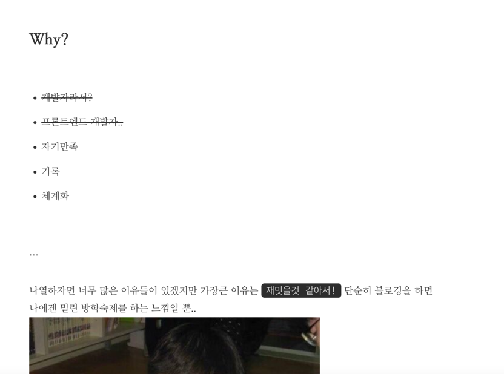

# @title Gatsby 기반 Custom 블로그 만들기
#### @description 인프런 _"React 기반 Gastsby로 기술블로그 개발하기"_ 로 만든 블로그 Customizing하기!

## What?
제일 먼저 뭘 시작해볼까?

우선 다음 두가지 과제를 최우선으로 해결하려고 한다.
>1. 적당히라도 외관 고치기
>2. 큰 카테고리, 서브카테고리, 주제 등등 블로그 정리 할 수 있는 틀 갖추기!

## Why?

...어....어.... 음... ~~메모장 아님~~

(~~죄송합니다 너무 잘 설명해주셔서 훌륭한 블로그를 시작할 수 있게 해준 강사님..~~)
일단 내가 아직 md 문서를 잘못다뤄서일것 같은데 가독성이 너~~무 떨어지는 상황, 그리고 추후 계획하는 카테고리, 주제 등등등을 표현해줄 디자인도 필요하고..
이런저런 이유보다는 나는 `프론트엔드` 개발자이기 때문에 외관을 당연히 먼저 고치고 싶다.

## How?
일단 목표를 정했으니까 무작정 이것저것 버무려 봐야지? 싶은데, 물론 잘 안되겠지만 이건 그러려고 하는 거니까? 그 과정에서 배우는게 많으니까 부담없이 재밌게!

(내맘에만 들면되지!)

## To be continue..
아마 처음으론 글씨체부터 손대볼까 싶다, 이것저것 바꿔가면서 맘에드는걸 찾아봐야지!
